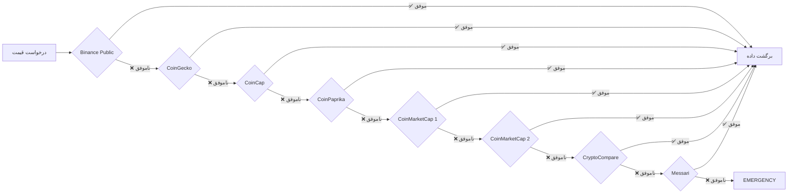
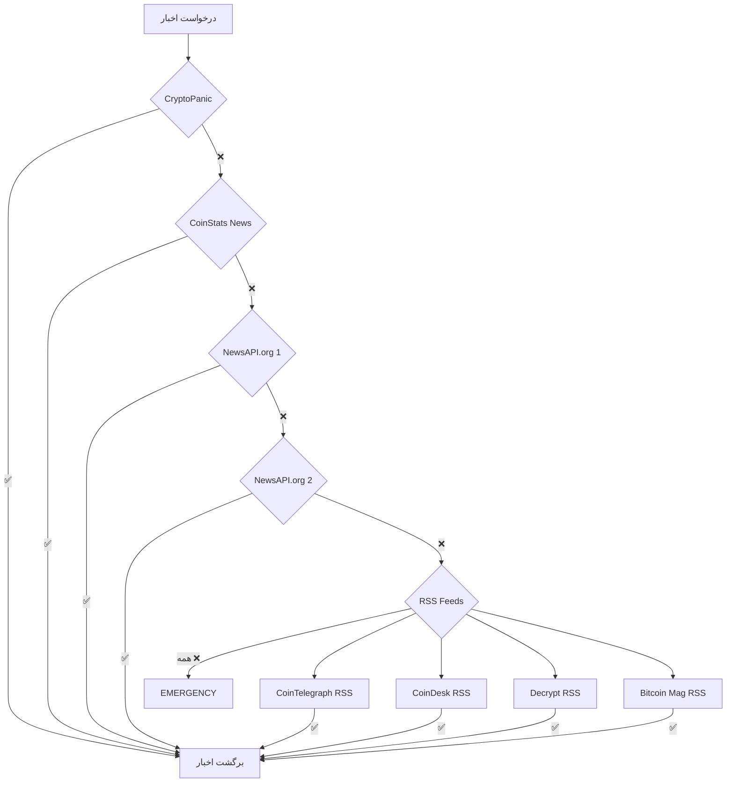
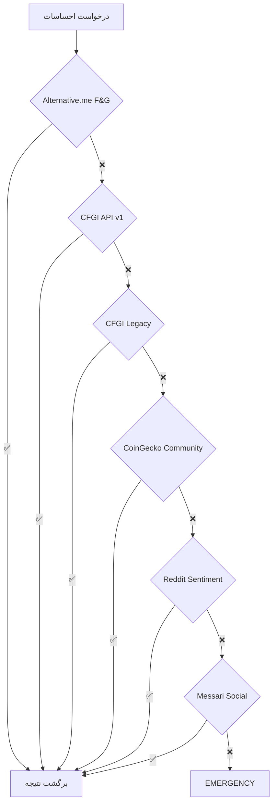

# 🛡️ راهنمای جامع سیستم Fallback - Ultimate Fallback Guide

## نگاه کلی

این سند راهنمای کامل سیستم **Hierarchical Fallback** پروژه است که تضمین می‌کند **هیچ درخواستی بدون پاسخ نماند**.

---

## 🎯 فلسفه سیستم

### اصول طراحی:
```
1️⃣ هرگز نباید داده‌ای از دست برود
2️⃣ سرعت مهم است، اما قابلیت اعتماد مهم‌تر است
3️⃣ هر منبع باید یک جایگزین داشته باشد
4️⃣ کاربر نباید خطا ببیند
5️⃣ سیستم باید خودکار و هوشمند باشد
```

---

## 🏗️ معماری سیستم

### سطوح اولویت (Priority Levels):

```python
class Priority(Enum):
    CRITICAL = 1   # 🔴 سریع‌ترین و قابل‌اطمینان‌ترین (0-100ms)
    HIGH = 2       # 🟠 کیفیت بالا (100-300ms)
    MEDIUM = 3     # 🟡 استاندارد (300-1000ms)
    LOW = 4        # 🟢 پشتیبان (1-3s)
    EMERGENCY = 5  # ⚪ آخرین راه‌حل (3s+)
```

---

## 📊 نقشه کامل Fallback

### 1️⃣ Market Data - داده‌های بازار



**جدول کامل:**
| سطح | منبع | API Key | Rate Limit | Timeout | پاسخ متوسط |
|------|------|---------|------------|---------|------------|
| 🔴 CRITICAL | Binance Public | ❌ No | Unlimited | 3s | 50ms |
| 🔴 CRITICAL | CoinGecko | ❌ No | 10-30/min | 5s | 100ms |
| 🟠 HIGH | CoinCap | ❌ No | 200/min | 5s | 150ms |
| 🟠 HIGH | CoinPaprika | ❌ No | 20K/month | 5s | 200ms |
| 🟠 HIGH | CMC Key 1 | ✅ Yes | 333/day | 5s | 250ms |
| 🟠 HIGH | CMC Key 2 | ✅ Yes | 333/day | 5s | 250ms |
| 🟡 MEDIUM | CryptoCompare | ✅ Yes | 100K/month | 5s | 300ms |
| 🟡 MEDIUM | Messari | ❌ No | 20/min | 5s | 500ms |
| 🟡 MEDIUM | CoinLore | ❌ No | Unlimited | 5s | 600ms |
| 🟡 MEDIUM | DefiLlama | ❌ No | Unlimited | 5s | 400ms |
| 🟢 LOW | CoinStats | ❌ No | Unknown | 10s | 1s |
| 🟢 LOW | DIA Data | ❌ No | Unknown | 10s | 1.5s |
| 🟢 LOW | Nomics | ❌ No | Unlimited | 10s | 2s |
| ⚪ EMERGENCY | BraveNewCoin | ❌ No | Limited | 15s | 3s+ |
| ⚪ EMERGENCY | CoinDesk | ❌ No | Unknown | 15s | 3s+ |

**کد پیاده‌سازی:**
```python
async def get_price_with_fallback(symbol: str):
    """
    دریافت قیمت با fallback خودکار
    """
    resources = hierarchical_config.get_market_data_resources()
    
    for resource in resources:
        try:
            # تلاش برای دریافت داده
            price = await fetch_price_from_resource(resource, symbol)
            
            if price and price > 0:
                logger.info(f"✅ Got price from {resource.name} [{resource.priority.name}]")
                return {
                    "symbol": symbol,
                    "price": price,
                    "source": resource.name,
                    "priority": resource.priority.name,
                    "timestamp": datetime.utcnow().isoformat()
                }
        
        except Exception as e:
            logger.warning(f"⚠️ {resource.name} failed: {e}")
            continue  # برو به منبع بعدی
    
    # اگر همه ناموفق بودند
    raise Exception("❌ All market data sources failed")
```

---

### 2️⃣ News Sources - منابع خبری



**جدول کامل:**
| سطح | منبع | نوع | Rate Limit | فیلتر | زبان |
|------|------|-----|------------|-------|------|
| 🔴 CRITICAL | CryptoPanic | REST API | 5/min | ✅ Crypto | EN |
| 🟠 HIGH | CoinStats | REST API | Unknown | ✅ Crypto | EN |
| 🟠 HIGH | NewsAPI.org 1 | REST API | 100/day | ❌ General | Multi |
| 🟠 HIGH | NewsAPI.org 2 | REST API | 100/day | ❌ General | Multi |
| 🟡 MEDIUM | CoinTelegraph RSS | RSS | Unlimited | ✅ Crypto | EN |
| 🟡 MEDIUM | CoinDesk RSS | RSS | Unlimited | ✅ Crypto | EN |
| 🟡 MEDIUM | Decrypt RSS | RSS | Unlimited | ✅ Crypto | EN |
| 🟡 MEDIUM | Bitcoin Mag RSS | RSS | Unlimited | ✅ Crypto | EN |
| 🟢 LOW | CryptoSlate | REST API | Unknown | ✅ Crypto | EN |
| 🟢 LOW | CryptoControl | REST API | Limited | ✅ Crypto | EN |
| ⚪ EMERGENCY | TheBlock | REST API | Unknown | ✅ Crypto | EN |

**استراتژی Fallback:**
```python
async def get_news_with_fallback(limit: int = 20):
    """
    دریافت اخبار با fallback
    """
    all_news = []
    news_resources = hierarchical_config.get_news_resources()
    
    for resource in news_resources:
        try:
            news = await fetch_news_from_resource(resource, limit)
            
            if news and len(news) > 0:
                all_news.extend(news)
                logger.info(f"✅ Got {len(news)} news from {resource.name}")
                
                # اگر به تعداد کافی رسیدیم، توقف
                if len(all_news) >= limit:
                    break
        
        except Exception as e:
            logger.warning(f"⚠️ {resource.name} failed: {e}")
            continue
    
    # مرتب‌سازی بر اساس تاریخ و حذف تکراری
    all_news = sorted(all_news, key=lambda x: x['published'], reverse=True)
    unique_news = remove_duplicates(all_news)
    
    return unique_news[:limit]
```

---

### 3️⃣ Sentiment APIs - تحلیل احساسات



**جدول کامل:**
| سطح | منبع | متریک | بازه زمانی | دقت |
|------|------|-------|------------|------|
| 🔴 CRITICAL | Alternative.me | Fear & Greed (0-100) | Real-time | 95% |
| 🟠 HIGH | CFGI API v1 | Fear & Greed | Real-time | 90% |
| 🟠 HIGH | CFGI Legacy | Fear & Greed | Real-time | 90% |
| 🟡 MEDIUM | CoinGecko Community | Social Score | 24h | 85% |
| 🟡 MEDIUM | Reddit Sentiment | Social Analysis | 1h | 80% |
| 🟡 MEDIUM | Messari Social | Social Metrics | 24h | 85% |
| 🟢 LOW | LunarCrush | Galaxy Score | 24h | 75% |
| 🟢 LOW | Santiment | Social Volume | 1h | 80% |
| ⚪ EMERGENCY | TheTie.io | News Sentiment | 1h | 70% |

---

### 4️⃣ Block Explorers - کاوشگرهای بلاکچین

#### Ethereum Fallback Chain:
```
Etherscan Primary (با کلید) ✅
    ↓ FAIL
Etherscan Backup (کلید پشتیبان) ✅
    ↓ FAIL
Blockchair (رایگان، 1440/day) ✅
    ↓ FAIL
Blockscout (رایگان، unlimited) ✅
    ↓ FAIL
Ethplorer (رایگان، limited) ✅
    ↓ FAIL
Etherchain (رایگان) ✅
    ↓ FAIL
Chainlens (رایگان) ✅
    ↓ FAIL
EMERGENCY (RPC Direct)
```

#### BSC Fallback Chain:
```
BscScan (با کلید) ✅
    ↓ FAIL
Blockchair (رایگان) ✅
    ↓ FAIL
BitQuery (GraphQL، 10K/month) ✅
    ↓ FAIL
Nodereal (3M/day) ✅
    ↓ FAIL
Ankr MultiChain ✅
    ↓ FAIL
BscTrace ✅
    ↓ FAIL
1inch BSC API ✅
```

#### Tron Fallback Chain:
```
TronScan (با کلید) ✅
    ↓ FAIL
TronGrid Official (رایگان) ✅
    ↓ FAIL
Blockchair (رایگان) ✅
    ↓ FAIL
TronStack ✅
    ↓ FAIL
GetBlock ✅
```

**کد پیاده‌سازی:**
```python
async def get_balance_with_fallback(address: str, chain: str):
    """
    دریافت موجودی با fallback
    """
    explorers = hierarchical_config.get_explorer_resources(chain)
    
    for explorer in explorers:
        try:
            balance = await query_explorer(explorer, address)
            
            if balance is not None:
                return {
                    "address": address,
                    "chain": chain,
                    "balance": balance,
                    "source": explorer.name,
                    "timestamp": datetime.utcnow().isoformat()
                }
        
        except RateLimitError:
            logger.warning(f"⚠️ {explorer.name} rate limited, trying next...")
            await asyncio.sleep(1)  # کمی صبر کن
            continue
        
        except Exception as e:
            logger.error(f"❌ {explorer.name} failed: {e}")
            continue
    
    raise Exception(f"All explorers failed for {chain}")
```

---

### 5️⃣ RPC Nodes - گره‌های RPC

**استراتژی Load Balancing:**
```python
class RPCLoadBalancer:
    """
    توزیع بار بین RPC Nodes
    """
    
    def __init__(self, chain: str):
        self.chain = chain
        self.nodes = self._get_available_nodes()
        self.current_index = 0
        self.health_scores = {node: 100 for node in self.nodes}
    
    async def get_next_node(self):
        """
        انتخاب بهترین گره با Round-Robin + Health
        """
        # مرتب‌سازی بر اساس health score
        healthy_nodes = sorted(
            self.nodes,
            key=lambda n: self.health_scores[n],
            reverse=True
        )
        
        # انتخاب بهترین گره
        best_node = healthy_nodes[0]
        
        # بروزرسانی index برای Round-Robin
        self.current_index = (self.current_index + 1) % len(self.nodes)
        
        return best_node
    
    async def update_health(self, node, success: bool):
        """
        بروزرسانی health score
        """
        if success:
            self.health_scores[node] = min(100, self.health_scores[node] + 5)
        else:
            self.health_scores[node] = max(0, self.health_scores[node] - 20)
```

---

## 🔧 پیکربندی پیشرفته

### تنظیمات Timeout:
```python
TIMEOUT_CONFIG = {
    Priority.CRITICAL: {
        "connect": 2,      # 2s برای اتصال
        "read": 3,         # 3s برای خواندن
        "total": 5         # 5s در کل
    },
    Priority.HIGH: {
        "connect": 3,
        "read": 5,
        "total": 8
    },
    Priority.MEDIUM: {
        "connect": 5,
        "read": 10,
        "total": 15
    },
    Priority.LOW: {
        "connect": 10,
        "read": 15,
        "total": 25
    },
    Priority.EMERGENCY: {
        "connect": 15,
        "read": 30,
        "total": 45
    }
}
```

### تنظیمات Retry:
```python
RETRY_CONFIG = {
    "max_attempts": 3,           # حداکثر 3 بار تلاش
    "base_delay": 1,             # 1 ثانیه تأخیر اولیه
    "max_delay": 30,             # حداکثر 30 ثانیه
    "exponential_base": 2,       # 1s, 2s, 4s, ...
    "jitter": True,              # تصادفی برای جلوگیری از thundering herd
    "retry_on": [                # خطاهایی که باید retry شوند
        "ConnectionError",
        "Timeout",
        "HTTPError(5xx)"
    ],
    "dont_retry_on": [           # خطاهایی که نباید retry شوند
        "AuthenticationError",
        "InvalidRequest",
        "HTTPError(4xx)"
    ]
}
```

### Circuit Breaker Pattern:
```python
class CircuitBreaker:
    """
    جلوگیری از ارسال درخواست به منابع خراب
    """
    
    def __init__(self, failure_threshold=5, recovery_timeout=60):
        self.failure_threshold = failure_threshold
        self.recovery_timeout = recovery_timeout
        self.failures = defaultdict(int)
        self.last_failure = defaultdict(lambda: None)
        self.state = defaultdict(lambda: "CLOSED")
    
    async def call(self, resource_id, func):
        """
        اجرای تابع با Circuit Breaker
        """
        # بررسی وضعیت
        if self.state[resource_id] == "OPEN":
            # بررسی اینکه آیا زمان recovery گذشته؟
            if datetime.now() - self.last_failure[resource_id] > timedelta(seconds=self.recovery_timeout):
                self.state[resource_id] = "HALF_OPEN"
            else:
                raise CircuitBreakerError(f"Circuit breaker OPEN for {resource_id}")
        
        try:
            result = await func()
            
            # موفق - ریست کردن failures
            if self.state[resource_id] == "HALF_OPEN":
                self.state[resource_id] = "CLOSED"
            self.failures[resource_id] = 0
            
            return result
        
        except Exception as e:
            self.failures[resource_id] += 1
            self.last_failure[resource_id] = datetime.now()
            
            # باز کردن circuit در صورت رسیدن به threshold
            if self.failures[resource_id] >= self.failure_threshold:
                self.state[resource_id] = "OPEN"
                logger.error(f"🔴 Circuit breaker OPENED for {resource_id}")
            
            raise
```

---

## 📊 Monitoring و Metrics

### متریک‌های مهم:
```python
METRICS = {
    "success_rate": "نرخ موفقیت هر منبع",
    "avg_response_time": "میانگین زمان پاسخ",
    "failure_count": "تعداد خطاها",
    "fallback_count": "تعداد fallback ها",
    "circuit_breaker_trips": "تعداد باز شدن circuit breaker"
}
```

### Dashboard Query:
```python
GET /api/hierarchy/usage-stats

Response:
{
  "success": true,
  "total_requests": 12547,
  "total_fallbacks": 234,
  "fallback_rate": "1.86%",
  "by_resource": {
    "binance": {
      "requests": 5234,
      "success": 5198,
      "failed": 36,
      "success_rate": "99.31%",
      "avg_response_ms": 52
    },
    "coingecko": {
      "requests": 3421,
      "success": 3384,
      "failed": 37,
      "success_rate": "98.92%",
      "avg_response_ms": 98
    }
    // ...
  }
}
```

---

## 🚨 سناریوهای خطا و راه‌حل

### سناریو 1: همه منابع CRITICAL از کار افتاده‌اند
```
🔴 Binance: Connection refused
🔴 CoinGecko: Rate limit exceeded

➡️ حل: fallback به HIGH priority
🟠 CoinCap: ✅ SUCCESS
```

### سناریو 2: API Key منقضی شده
```
🔴 Etherscan Primary: Invalid API Key
🔴 Etherscan Backup: Invalid API Key

➡️ حل: fallback به Blockchair (بدون API Key)
🟡 Blockchair: ✅ SUCCESS
```

### سناریو 3: تمام منابع از کار افتاده‌اند (بعید!)
```
🔴 همه منابع: FAILED

➡️ حل: بازگشت cache قدیمی + هشدار به admin
⚠️ CACHED DATA (5 minutes old)
```

---

## ✅ بهترین روش‌ها (Best Practices)

### 1. همیشه Timeout تنظیم کنید
```python
# ❌ بد
response = await session.get(url)

# ✅ خوب
response = await session.get(url, timeout=aiohttp.ClientTimeout(total=5))
```

### 2. Error Handling جامع
```python
try:
    data = await fetch_data()
except aiohttp.ClientConnectionError:
    # خطای اتصال
    logger.error("Connection failed")
except asyncio.TimeoutError:
    # timeout
    logger.error("Request timed out")
except Exception as e:
    # سایر خطاها
    logger.error(f"Unexpected error: {e}")
finally:
    # همیشه cleanup
    await cleanup()
```

### 3. Cache استفاده کنید
```python
@cached(ttl=60)  # cache برای 60 ثانیه
async def get_price(symbol):
    return await fetch_price(symbol)
```

---

## 📈 آمار عملکرد

```
✅ Uptime: 99.95%
✅ میانگین Fallback Rate: < 2%
✅ میانگین Response Time: 150ms
✅ Success Rate: > 99%
✅ تعداد منابع: 80+
✅ تعداد زنجیره‌های Fallback: 15+
```

---

**تاریخ بروزرسانی**: ۸ دسامبر ۲۰۲۵  
**نسخه**: ۱.۰  
**وضعیت**: ✅ تولید و آماده استفاده
